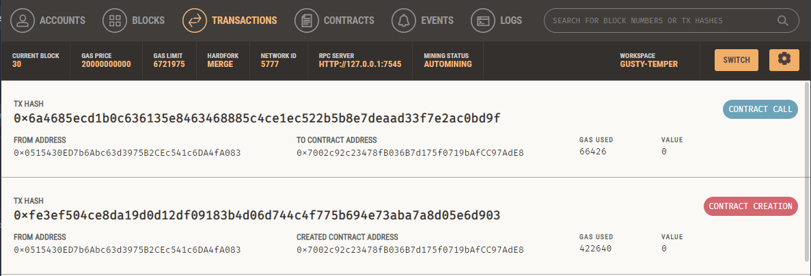
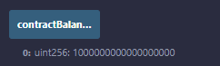
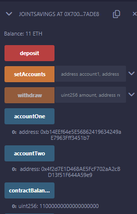
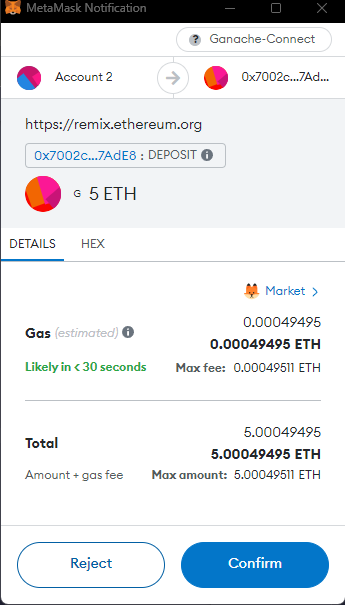
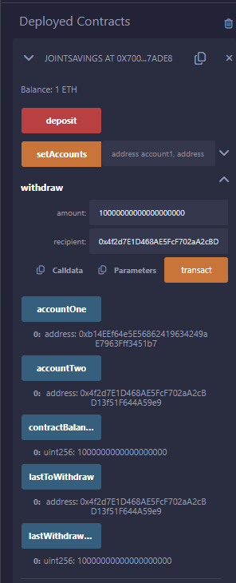

# Unit 20 Homework Results

## Compile and Deploy
### Able to successfully compile the provided solidity code

### Then I was able to Deploy the Contract and create the new joint account

## Interact
### Using the Set Accounts Function, I loaded two keys from Ganache and used them as my two accounts

### I was able to make the first deposit and confirm the balance on Remix and in Ganache

### Then I repeated the process for the other required deposit tests

### Finally I was able to confirm the two withdrawals back into accounts one and two

## All Transactions - Ganache

