

    
# Decentralized Joint Account
    
##### Created by [Demi Oyebanji](mailto:oluwademiladeoyebanji@outlook.com) as an assignment for the **UofT SCS Financial Technology Bootcamp**
________________________________________________________________________________________________________

In this file, I create a basic Joint Account smart contract in Solidity that allows verified account owners to withdraw and deposit funds

**Withdraw Function**

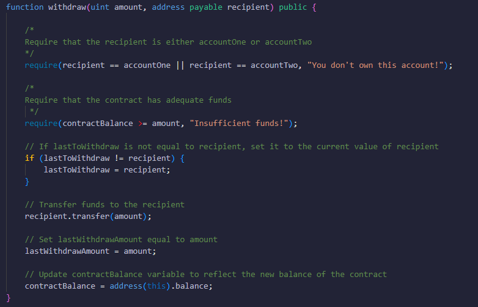

**Deposit Function**

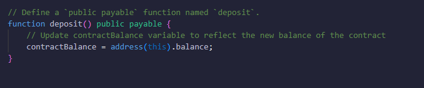

## Test Results
### Compile the solidity file

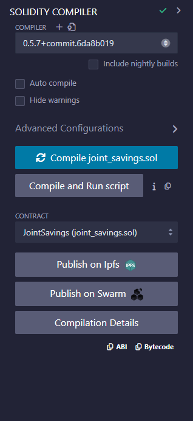

### Deploy the contract to generate a new Joint Account

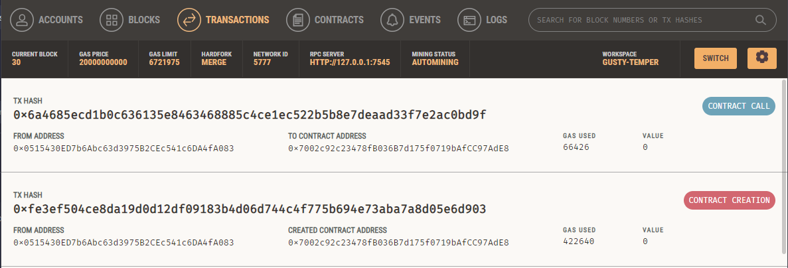

### Using the Set Accounts Function, input the two accounts that own the Joint Account

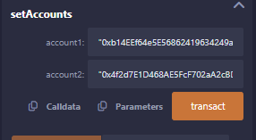

### Make a Deposit using MetaMask

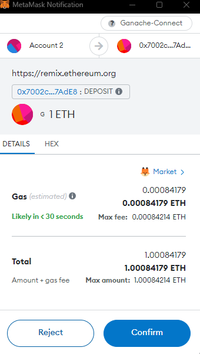
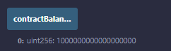
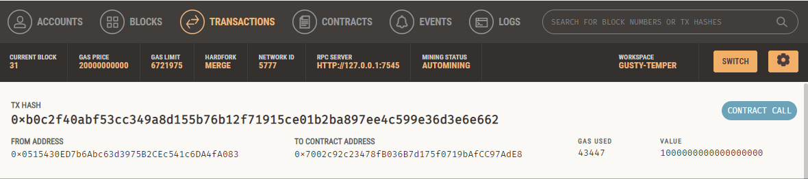

### Make more deposits

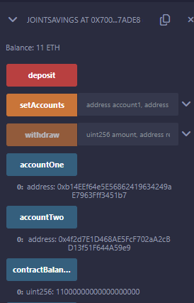

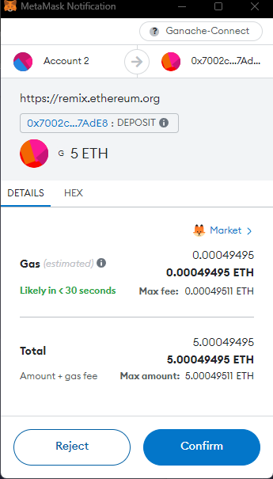
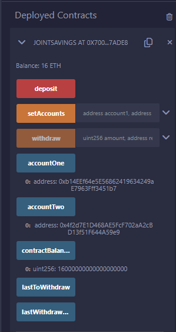

### Withdraw money back to accounts 1 and 2

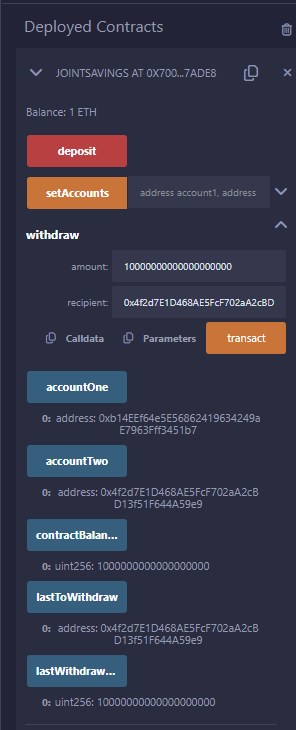

## All Test Transactions - Ganache

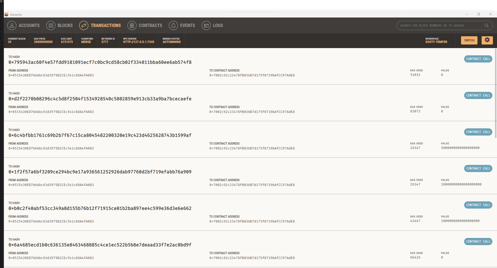

